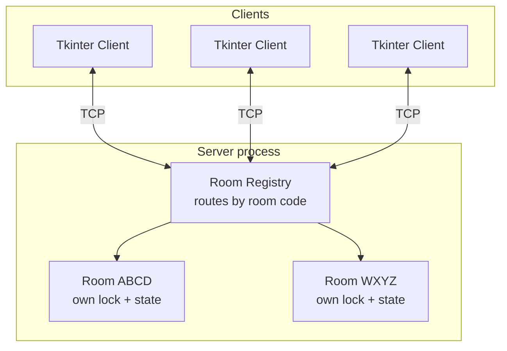
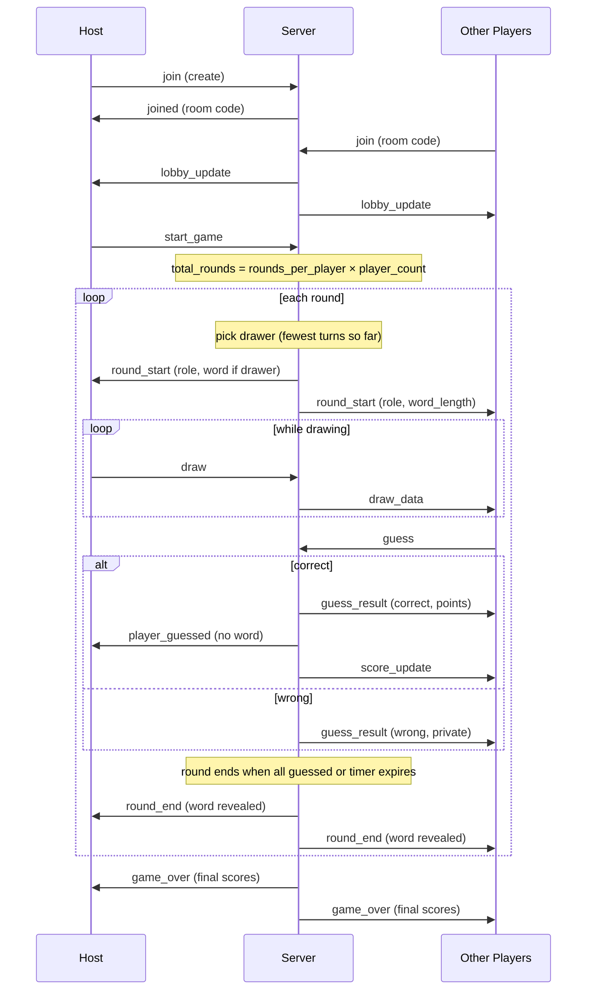

# SketchMesh — Real-Time Multiplayer Drawing Game

A real-time multiplayer drawing-and-guessing game built entirely on the Python standard library: raw **TCP sockets**, **threading**, and a **Tkinter** GUI. Players join rooms with a share code, take turns drawing a secret word while everyone else guesses, and score based on how fast they guess.

No frameworks. No external dependencies. No WebSockets, Socket.IO, Flask, or async runtime — the networking layer, application protocol, and concurrency model are all implemented from scratch.

Players who drop mid-game — closed laptop, WiFi blip, accidental window close — **reconnect straight back into their seat** with their score, role, remaining time, and the drawing so far fully restored.

**Measured:** 128 concurrent players across 16 rooms, ~5,900 stroke broadcasts/second, p99 relay latency under 1 ms, zero errors. See [Performance](#performance).

---

## Contents

- [Overview](#overview)
- [Features](#features)
- [Architecture](#architecture)
- [Network Architecture](#network-architecture)
- [Communication Protocol](#communication-protocol)
- [Reconnection & Session Resume](#reconnection--session-resume)
- [Game Flow](#game-flow)
- [Concurrency Model](#concurrency-model)
- [Performance](#performance)
- [Project Structure](#project-structure)
- [Installation](#installation)
- [Running the Game](#running-the-game)
- [Configuration](#configuration)
- [Testing](#testing)
- [Troubleshooting](#troubleshooting)
- [Design Decisions](#design-decisions)
- [Limitations](#limitations)
- [Future Work](#future-work)
- [Interview Questions](#potential-interview-questions)

---

## Overview

The server is **authoritative**: it owns whose turn it is, the secret word, the scores, and the round timer. Clients render what they're told and forward user input. They never decide whether a guess was correct or who draws next.

That split is the only way to guarantee every player sees a consistent game. A client can send garbage, spoof a message, or drop mid-round — none of it can corrupt the server's state, only fail to have its request honoured. Concretely, the server enforces that only the current drawer may draw, that the drawer can't guess their own word, that a correct guess doesn't leak the word to players still guessing, and that a player can't score twice for the same round.

TCP was chosen over UDP because game-state messages (role assignment, scoring, round transitions) must arrive reliably and in order — losing a `round_start` would desync a player for the whole round. See [Design Decisions](#design-decisions).

---

## Features

**Multiplayer**
- Rooms of 2–8 players with shareable 4-character join codes
- Multiple independent games run concurrently on one server process
- Quick-play matchmaking into any room with space
- Host controls when the game starts; host role reassigns automatically if they leave
- Players joining mid-game are rejected cleanly rather than corrupting a running round

**Gameplay**
- Drawer rotation that stays fair when players join or leave mid-game
- Speed-based scoring: a correct guess earns a base amount plus a bonus that decays over the round
- The drawer scores per player who guesses their drawing
- Round ends early once everyone has guessed
- Word-length hint for guessers; the word itself never reaches a guesser's client until the round ends
- Wrong guesses are private to the guesser and don't spoil the round for others

**Drawing**
- Real-time stroke synchronization across all guessers
- 12-colour palette, custom colour picker, eraser, adjustable brush size
- Undo — removes the drawer's last stroke on every client, via stroke-ID tagging

**Resilience**
- Session tokens decouple player identity from the socket
- Dropped players hold their seat, score, role, and rotation position for a grace period
- Automatic client reconnection with linear backoff
- Full state snapshot on resume: scores, role, live timer, and every stroke drawn while away
- Stale-socket eviction so a reconnect can't leave two connections claiming one player
- The same snapshot machinery allows joining a game already in progress

**Engineering**
- Newline-delimited JSON framing that correctly handles TCP's byte-stream semantics
- Per-room locks so activity in one room never blocks another
- Sockets never written to while a lock is held (bounded lock hold times)
- Round-token invalidation so stale timers can't corrupt a later round
- Thread-safe GUI updates via queue + `root.after`
- 32 unit tests, a 17-check real-socket smoke test, and a load-testing harness

---

## Architecture



Responsibilities are split deliberately:

| Component | Owns |
|---|---|
| `server/game_server.py` | Sockets, the join handshake, room registry, message dispatch |
| `server/room.py` | All game logic: rounds, rotation, scoring, timers, relay rules |
| `common/protocol.py` | Message framing — the single source of truth for both sides |
| `client/game_client.py` | Rendering and input only; no game-state decisions |

Game logic lives entirely in `room.py` and has no socket dependencies beyond calling `send`, which is why it's fully unit-testable with fake sockets.

---

## Network Architecture

| Concept | Role in this project |
|---|---|
| **Server socket** | Bound once, listening. Never carries game data — only accepts connections. |
| **`bind()` / `listen()`** | Reserves host IP/port and queues incoming connection attempts. |
| **`accept()`** | Blocks until a client connects, returning a *new* socket dedicated to that client. The server loops forever, spawning one thread per accepted connection. |
| **Client socket** | One per client for the whole session — both sending input and receiving broadcasts. |
| **`sendall()`** | Used instead of `send()` so partial writes are handled by the library rather than manual retry loops. |
| **`recv()`** | TCP is a **byte stream**, not a message stream. One `recv()` may contain a fragment of a message, exactly one, or several. Handled explicitly — see below. |
| **`TCP_NODELAY`** | Disables Nagle's algorithm. Strokes are small and latency-sensitive; without it, the kernel would buffer them waiting for more data. |

---

## Communication Protocol

Every message is a JSON object terminated by `\n`. `json.dumps` never emits a raw newline inside a message, so splitting an accumulated buffer on `"\n"` unambiguously separates messages. This correctly handles both a message split across several `recv()` calls and several messages coalesced into one. Implemented once in `common/protocol.py` and shared by both sides.

### Client → Server

| Type | Purpose | Example |
|---|---|---|
| `join` | Join or create a room | `{"type":"join","name":"Arya","room_code":"ABCD"}` |
| `rejoin` | Resume a dropped session | `{"type":"rejoin","room_code":"ABCD","token":"a1b2c3..."}` |
| `start_game` | Host starts the match | `{"type":"start_game"}` |
| `draw` | One stroke segment | `{"type":"draw","x1":10,"y1":20,"x2":15,"y2":25,"color":"#111","width":3,"stroke_id":7}` |
| `undo` | Remove a stroke | `{"type":"undo","stroke_id":7}` |
| `clear` | Clear the canvas | `{"type":"clear"}` |
| `guess` | Submit a guess | `{"type":"guess","guess":"apple"}` |
| `chat` | Send a message | `{"type":"chat","text":"nice one"}` |

### Server → Client

| Type | Sent to | Purpose |
|---|---|---|
| `joined` | Joiner | Room code, player ID, display name, **session token**, and `resumed: true` if this was a reconnect |
| `state_sync` | Joiner | Full snapshot: scores, role, round, time left, and every stroke this round. Sent on reconnect and on joining mid-game |
| `player_reconnected` | Room | Someone came back |
| `lobby_update` | Room | Player list, host ID, min/max players |
| `round_start` | Room | Role, round number, drawer name, duration. **Only the drawer's copy contains `word`**; guessers get `word_length` |
| `draw_data` | Guessers | Relayed stroke segment |
| `undo_stroke` | Guessers | Relayed stroke removal |
| `clear_canvas` | Room | Wipe the canvas |
| `guess_result` | One player | `correct` (with word + points) or `wrong` — never broadcast |
| `player_guessed` | Others | Someone guessed, and for how many points — **without the word** |
| `score_update` | Room | Full ranked scoreboard |
| `timer_update` | Room | Seconds remaining |
| `round_end` | Room | Word reveal, reason, scores |
| `game_over` | Room | Final ranked scores |
| `player_left` | Room | Someone disconnected |
| `error` | One client | Join rejected, not the host, etc. |

Note the deliberate asymmetry around `guess_result` / `player_guessed`: broadcasting a correct guess with the word attached would spoil the round for everyone still guessing. There's a unit test and a smoke check specifically guarding this.

---

## Reconnection & Session Resume

A player who drops mid-game gets their seat back — same score, same role, same drawing on screen, timer still counting.

### The problem

The obvious design keys players by their socket object. That works until the socket dies, which is exactly when you need the player's identity most. TCP also doesn't tell you promptly that a peer is gone: a client that closed its laptop may look connected to the server for a while, and a client that reconnects fast often arrives *before* the server has noticed the old connection died.

### How it works

**1. Identity is a token, not a socket.** On join, the server issues a `uuid4` session token and keeps a `token -> player_id` map. The `Player` record holds `sock` (nullable) separately from identity, so the socket can die without the player doing so.

**2. Seats are held, not freed.** When a socket drops mid-game the player is marked disconnected with `sock=None`, but keeps their score, role, and rotation position for `SESSION_GRACE_SECONDS` (default 90). A background timer frees the seat if they don't return. In the *lobby* there's no state worth preserving, so they're removed immediately.

**3. Return is a snapshot, not a replay.** The client reconnects with `{"type": "rejoin", "room_code": ..., "token": ...}`. The server swaps the new socket into the existing `Player` and sends one `state_sync` containing everything needed to rebuild: scores, role, round number, remaining time, and every stroke drawn this round.

Snapshot over delta-replay is deliberate. A delta stream needs the client to know exactly where its knowledge ended, and any gap silently corrupts state. A snapshot is idempotent — applying it twice is harmless — which matters when you can't be sure how much the client missed.

**4. Strokes are logged, bounded.** The server otherwise has no reason to remember drawing content — it's a dumb relay. But without a log, a returning player stares at a blank canvas for the rest of the round. So `Room.stroke_log` records the current round's strokes, capped at `MAX_STROKES_PER_ROUND` (default 4000) so a misbehaving client can't grow it without limit, and cleared on every round start and canvas clear.

**5. Vanished peers are detected in ~35s, not 2 hours.** A client that exits or crashes sends FIN or RST and `recv()` returns in about 50 ms (measured). But a laptop whose lid closes, or a device dropping off WiFi, sends *nothing* — the socket stays open on the server and `recv()` blocks until TCP keepalive fires, which on Linux defaults to **7200 seconds**. Left alone, a vanished player would hold their seat for two hours: slot occupied against the 8-player cap, name stuck in the lobby, room never collected. `SO_KEEPALIVE` plus tuned `TCP_KEEPIDLE`/`KEEPINTVL`/`KEEPCNT` brings that to ~35s, comfortably inside the 90s grace period. This matters here specifically because "my WiFi dropped" is the exact scenario the whole feature exists for.

**6. Stale sockets are evicted.** `reattach()` closes the previous socket before installing the new one. Without this a fast reconnect leaves two live sockets claiming the same player.

**7. Late callbacks are ignored.** `remove_player()` takes the socket that died and no-ops if it isn't the player's *current* socket. Otherwise this sequence breaks everything:

```
t=0    player's WiFi drops
t=1    player reconnects, gets a new socket        <- player is back
t=2    old socket's recv loop finally returns b""  <- fires remove_player
t=3    ...which would knock them straight offline again
```

That ordering is not hypothetical — it's the common case on a fast reconnect, and there's a regression test for it (`test_stale_recv_loop_cannot_disconnect_a_reconnected_player`).

### Client side

The client stores its token, and on connection loss retries automatically with linear backoff (up to 10 attempts, ~30s total — deliberately shorter than the 90s server grace period, so it never gives up on a seat that's still being held).

Each socket's receive thread carries a generation number. On reconnect the generation bumps, so a late `_lost` from the dead thread is discarded rather than tearing down the new connection — the client-side mirror of the server's stale-callback problem.

### Falling out of it for free

Joining a game **already in progress** used to be rejected. A latecomer and a returning player have the same problem — an empty client that needs catching up — so they now share one code path. New joiners enter the rotation behind everyone (`times_drawn` set to the current max) so they can't cut the drawing queue.

### What's still not handled

- Tokens are unauthenticated bearer strings. Anyone who obtained one could hijack that session. Fine for LAN, not for the open internet.
- Tokens live in memory: a server restart invalidates every session.
- If the *drawer* drops, the round ends rather than pausing for them.

---

## Game Flow



---

## Concurrency Model

| Thread | Count | Purpose |
|---|---|---|
| Accept loop | 1 | `accept()` on the listening socket |
| Client handler | 1 per connection | Blocking `recv()` loop + dispatch |
| Round timer | 1 per active round | Ticks the countdown, ends the round |
| Intermission | 1 per round transition | Delays the next round |
| Client receive | 1 per client process | Reads the socket, feeds the GUI queue |

Three specific problems this design solves:

**1. Lock hold times bounded by computation, not I/O.**
Methods build an "outbox" of `(socket, message)` pairs under the room lock, release it, then send. A half-dead client can block in `sendall()` for a long time; holding the room lock across that would stall everyone else in the room.

**2. Stale timers can't corrupt a later round.**
Each round has a monotonically increasing `round_token`. A timer thread captures the token when it starts and exits immediately if it changed. Without this, a round that ended early (everyone guessed) would leave its timer alive to fire later and prematurely end the *next* round. This has a dedicated regression test.

**3. Tkinter is not thread-safe.**
Widgets must only be touched from the thread running `mainloop()`. The network thread never touches widgets — it pushes decoded messages onto a `queue.Queue`, drained on the main thread via `root.after()`.

---

## Performance

Measured with the included harness (`bench/`), which spawns headless bot clients over real TCP sockets, has them play automatically, and records the time from the drawer's `sendall()` to a guesser's receive loop decoding that same stroke (matched by `stroke_id`).

| Rooms | Players | Strokes/s per drawer | Deliveries/s | p50 | p95 | p99 | max | Errors |
|---:|---:|---:|---:|---:|---:|---:|---:|---:|
| 1 | 2 | 30 | 27 | 0.10 ms | 0.13 ms | 0.14 ms | 0.18 ms | 0 |
| 1 | 8 | 30 | 186 | 0.17 ms | 0.24 ms | 0.33 ms | 0.47 ms | 0 |
| 4 | 32 | 30 | 744 | 0.21 ms | 0.43 ms | 0.63 ms | 1.05 ms | 0 |
| 8 | 64 | 60 | 2,950 | 0.17 ms | 0.39 ms | 0.59 ms | 7.78 ms | 0 |
| 16 | 128 | 60 | 5,897 | 0.14 ms | 0.29 ms | 0.45 ms | 17.32 ms | 0 |

Reproduce with:

```bash
python -m bench.run_benchmarks
```

**What these numbers do and don't mean — read this before quoting them.**

- Measured on a **single-core** container, over **loopback**, with the bot clients sharing that core with the server. They isolate *server relay cost*, not real-world network time.
- A real two-machine LAN run will be higher by the physical network RTT (typically 0.5–2 ms on wired Ethernet), which will dominate these numbers entirely.
- Median latency stays flat (~0.15 ms) across a 200× increase in throughput, and error count stays at zero — the fan-out scales linearly. But **tail latency degrades** under load: max climbs from 0.18 ms to 17 ms between the lightest and heaviest runs. That's GIL contention and scheduler jitter, and it's the honest ceiling signal on one core.
- These are not claims about production readiness. They're a characterization of where the current design starts to strain, which is what the [Future Work](#future-work) section responds to.

---

## Project Structure

```
.
├── server/
│   ├── game_server.py    # Sockets, join handshake, room registry, dispatch
│   └── room.py           # All game logic: rounds, rotation, scoring, timers
├── client/
│   └── game_client.py    # Tkinter GUI: connect → lobby → game
├── common/
│   ├── config.py         # Env-overridable configuration
│   └── protocol.py       # Message framing (shared by both sides)
├── tests/
│   ├── test_protocol.py  # Framing edge cases with fake sockets
│   ├── test_room.py      # Game logic, 32 unit tests total
│   ├── smoke_test.py     # 30 checks over real sockets, no GUI
│   └── test_resilience.py # 19 timing-dependent reconnection checks
├── bench/
│   ├── loadtest.py       # Headless bot clients + latency instrumentation
│   ├── run_benchmarks.py # Self-contained sweep across load levels
│   └── results.json      # Saved measurements
├── .github/workflows/ci.yml
├── requirements.txt
└── README.md
```

---

## Installation

Requires **Python 3.10+**. Tkinter ships with the standard Windows and macOS installers.

```bash
python --version          # confirm 3.10+
sudo apt install python3-tk   # Linux only, if Tkinter is missing
```

No `pip install` needed — standard library only.

---

## Running the Game

### Start the server (once, on the host machine)

```bash
python -m server.game_server
```

Binds to `0.0.0.0:12345` by default, so you don't need to know your IP for this step.

### Find the host's IP (only for multi-machine play)

- **Windows:** `ipconfig` → IPv4 Address
- **macOS/Linux:** `ip addr` or `ifconfig` → `inet`

### Start a client (each player)

```bash
python -m client.game_client
```

A connect screen opens. Enter your name, the server IP (`127.0.0.1` for same-machine testing), and either:
- **New room** — creates a room and shows a 4-character code to share
- **Join** with a code — joins that specific room
- **Join** with the code blank — quick-play into any room with space

The host presses **Start game** once at least 2 players are in the lobby.

### Single-machine test

Four terminals: one running the server, three running clients, all using `127.0.0.1`.

---

## Configuration

Set before starting the server:

| Variable | Default | Meaning |
|---|---|---|
| `SKETCHMESH_HOST` | `0.0.0.0` | Bind address |
| `SKETCHMESH_PORT` | `12345` | Port |
| `SKETCHMESH_MIN_PLAYERS` | `2` | Minimum to start |
| `SKETCHMESH_MAX_PLAYERS` | `8` | Room capacity |
| `SKETCHMESH_ROUNDS` | `2` | Rounds **per player** (total = this × player count) |
| `SKETCHMESH_ROUND_TIME` | `60` | Seconds per round |
| `SKETCHMESH_INTERMISSION` | `4` | Seconds between rounds |
| `SKETCHMESH_GRACE` | `90` | Seconds a disconnected player keeps their seat |
| `SKETCHMESH_MAX_STROKES` | `4000` | Cap on the per-round replay log |
| `SKETCHMESH_REAP_INTERVAL` | `30` | How often abandoned rooms are collected |
| `SKETCHMESH_RECONNECT_ATTEMPTS` | `10` | Client retries before giving up |
| `SKETCHMESH_KEEPALIVE_IDLE` | `20` | Seconds idle before probing a silent peer |
| `SKETCHMESH_KEEPALIVE_INTERVAL` | `5` | Seconds between keepalive probes |
| `SKETCHMESH_KEEPALIVE_COUNT` | `3` | Failed probes before declaring a peer dead |

---

## Testing

```bash
python -m unittest discover -s tests -v   # 52 unit tests, no network or GUI
python -m tests.smoke_test                 # 30 checks over real TCP sockets
python -m tests.test_resilience            # 19 timing-dependent checks (~30s)
python -m bench.run_benchmarks             # load test sweep
```

CI runs all three suites on Python 3.10, 3.11, and 3.12.

**Unit tests** (`test_protocol.py`, `test_room.py`) use fake sockets — instant and deterministic. They cover framing edge cases (split reads, coalesced reads, malformed lines), lobby lifecycle, drawer rotation fairness, speed-based scoring, word-leak prevention, disconnect handling, stale-timer invalidation, and the full reconnection path: token issuance, seat holding, snapshot contents, word-leak prevention on resume, stale-socket eviction, late-callback rejection, grace-period expiry, and stroke-log bounding.

**Resilience tests** (`test_resilience.py`) cover what only appears with real time and real sockets: a held seat actually expiring, the reaper actually collecting an abandoned room, reconnecting as the drawer, reconnecting after the round advanced, two players resuming simultaneously, and reusing a token twice without creating a duplicate player.

**Smoke test** exercises the real network path: real sockets, real threads, real framing, real dispatch. Includes a hard socket kill mid-round followed by a token resume, asserting that strokes drawn *before and during* the outage are all replayed. Runs headless so CI can execute it.

**Not automated:** the Tkinter GUI itself, and real multi-machine LAN conditions. Those were verified manually (and during development, via scripted Tk instances driven through actual event handlers under a virtual display).

### Manual LAN checklist

- [ ] Server starts and prints its bind address
- [ ] Multiple clients on different machines join with a room code
- [ ] Quick play (blank code) lands players in the same room
- [ ] A 9th player is rejected with a clear message
- [ ] Only the host sees Start game; it appears once 2+ players join
- [ ] Strokes appear live on every guesser's canvas
- [ ] Undo removes the stroke everywhere
- [ ] Guessers see no drawing tools and cannot draw
- [ ] Wrong guesses are visible only to the guesser
- [ ] A correct guess doesn't reveal the word to players still guessing
- [ ] Round ends early once everyone guesses
- [ ] Faster guesses score higher
- [ ] Drawer rotates so everyone draws before anyone draws twice
- [ ] Closing a client mid-game notifies the room; game continues if 2+ remain
- [ ] Host leaving reassigns the host
- [ ] Killing a client mid-round and reopening it restores score, role, timer, and drawing
- [ ] The reconnecting player sees a "Reconnecting…" status, not a dead screen
- [ ] Other players are told when someone drops and when they return
- [ ] A player away longer than the grace period loses their seat cleanly
- [ ] A new player joining mid-game is synced into the running round

---

## Troubleshooting

| Symptom | Cause |
|---|---|
| "Couldn't connect" | Server not running, or wrong IP/port |
| "No room found with code X" | Typo, or that room closed when it emptied |
| "This room is full" | 8 players already in it |
| "That game is already in progress" | Rooms don't accept joins mid-game |
| `ModuleNotFoundError: common` | Run from the project root, not inside a subfolder |
| Port already in use | Set `SKETCHMESH_PORT` to something else |
| Windows Firewall prompt | Allow Python for **private** networks |

---

## Design Decisions

**Why TCP over UDP?**
Game-state messages must arrive reliably and in order — a lost `round_start` desyncs a player for the entire round, and a lost `score_update` leaves a wrong scoreboard on screen. UDP would require hand-rolling reliability and ordering on top, which is strictly more work for no benefit at this scale. The trade-off is head-of-line blocking, which doesn't matter here because strokes aren't frame-critical.

**Why threads instead of asyncio?**
`accept()` and `recv()` are blocking. One thread per connection is simple, readable, and adequate for tens of players per process — which the benchmarks confirm. At thousands of concurrent connections the per-thread stack cost and GIL contention would justify `asyncio` or `selectors`, and the tail-latency degradation in the benchmark table is the first visible sign of that ceiling.

**Why newline-delimited JSON rather than length-prefixed binary?**
JSON is debuggable (you can read the wire with `nc`), trivially serializable, and flexible as the protocol evolves. Length-prefixed binary would be more compact and avoid the delimiter constraint, but at these message rates the bottleneck is fan-out, not payload size.

**Why does the drawer rotate by fewest-turns instead of round index?**
`order[round % n]` breaks when players join or leave mid-game — the modulus shifts and someone gets skipped or drawn twice. Tracking `times_drawn` per player and picking the minimum keeps the rotation fair regardless of churn.

**Why is stroke history not stored server-side?**
The server never validates or replays drawing content, so storing it would be memory spent for nothing. Undo works by relaying intent: the drawer tags strokes with an ID, and `undo_stroke` tells other clients to delete canvas items with that tag. The trade-off is that a client joining mid-round would see a blank canvas — acceptable because joins mid-game are rejected anyway.

---

## Limitations

Honest list of what this does **not** do:

- **LAN / same-network only.** No NAT traversal or public matchmaking. Internet play needs port forwarding or a hosted server.
- **No authentication or encryption.** Anyone who can reach the port can join a room. Session tokens are unauthenticated bearer strings — anyone who obtains one can hijack that session.
- **Sessions don't survive a server restart.** Tokens live in memory only.
- **A dropped drawer ends the round** rather than pausing for them to return.
- **No persistence.** All state is in memory; a server restart loses every room. No match history or accounts.
- **Desktop only.** Tkinter — no mobile or web client.
- **Single process, no horizontal scaling.** Rooms live in one process's memory, so you can't run two server instances behind a load balancer without shared state.
- **Benchmarks are loopback, single-core.** See the caveats in [Performance](#performance).

---

## Future Work

Not implemented — listed as direction, not claims:

- Signed/expiring session tokens so a leaked token can't be replayed
- Persisting sessions so a server restart doesn't end every game
- Pausing a round when the drawer drops, instead of ending it
- `asyncio`/`selectors` rewrite of the transport if connection counts justify it
- Redis-backed room registry to allow multiple server processes
- TLS plus a join handshake before accepting gameplay messages
- Stroke batching (coalescing several segments per message) to cut fan-out volume
- LAN discovery via UDP broadcast so players don't type an IP
- Custom word lists, difficulty tiers, and per-room settings

---

## Potential Interview Questions

**Why TCP instead of UDP?** — See [Design Decisions](#design-decisions).

**How does the server handle many clients simultaneously?**
One thread per accepted connection, each with its own blocking `recv()` loop. Rooms each hold their own lock, so activity in one room never blocks another, and the registry lock is only held briefly for lookups.

**What is TCP message framing and why does it matter?**
TCP delivers a byte stream, not discrete messages — one `send()` may arrive as part of a `recv()`, exactly one, or several coalesced. Each message is terminated with `\n` and partial data buffered until a full line is available. There are unit tests for all three cases specifically.

**How do you prevent a client from cheating?**
The server is authoritative and validates every action against its own state: only the current drawer's strokes are relayed, the drawer can't guess their own word, a player can't score twice in a round, and non-hosts can't start a game. The word never reaches a guesser's client until the round ends, so it can't be extracted by inspecting client memory or traffic.

**What race conditions did you have to handle?**
Two concrete ones. First, shared room state is touched from multiple client threads — all reads and writes go through a per-room lock. Second, a round that ends early leaves its timer thread alive; without invalidation, it would later fire and prematurely end the *next* round. That's solved with a round token the timer checks before acting, and it has a dedicated regression test.

**Why not hold the lock while sending?**
`sendall()` can block for an unbounded time on a slow or half-dead client. Holding the room lock across that would stall every other player in the room. Messages are queued under the lock and flushed after releasing it, so hold time is bounded by computation.

**Why is Tkinter a problem with threads?**
Widgets should only be touched from the thread running `mainloop()`. Violating that produces intermittent, hard-to-reproduce failures rather than clean errors. The network thread pushes to a `queue.Queue`; the main thread drains it via `root.after()`.

**How would you scale this to thousands of players?**
Three separate bottlenecks. Transport: swap one-thread-per-connection for `asyncio`/`selectors`. State: move the room registry into Redis so multiple processes can serve rooms. Fan-out: batch stroke segments per message rather than one message per segment. The benchmark data shows where the current design starts to strain — flat median but degrading tail latency past ~64 concurrent players on one core.

**How would you secure it?**
TLS via `ssl.SSLContext` for transport, plus a join handshake before any gameplay message is accepted. Currently room codes provide obscurity, not security.

**How does reconnection work, and what makes it hard?**
Player identity is a session token, not a socket, so the socket can die without the player doing so. The seat is held for a grace period, and on return the server sends one idempotent state snapshot rather than a delta stream — a delta needs the client to know exactly where its knowledge ended, and any gap silently corrupts state. The genuinely hard part is ordering: a client usually reconnects *before* the server's recv loop has noticed the old socket died, so `reattach` evicts the stale socket, and `remove_player` ignores callbacks from a socket that is no longer the player's current one. Without that second guard, the old connection's death notice arrives moments after the reconnect and knocks the player straight back offline.

**Why snapshot instead of replaying missed messages?**
Idempotence. Applying a snapshot twice is harmless; replaying a delta stream requires knowing precisely which message the client last saw, and getting that boundary wrong corrupts state silently. Snapshots also cost bounded memory — one stroke log per round, capped — where a per-client message backlog would grow with outage length.

**What happens if the server crashes?**
Every client's `recv()` returns empty, they surface "Lost connection," and the game is unrecoverable — no persistence, no reconnect. Listed honestly under Limitations rather than hidden.

**How would you test networking code?**
Three layers, as done here: unit tests with fake sockets for framing and game logic (fast, deterministic, cover edge cases like split reads); a real-socket smoke test for the actual network path; and a load harness with headless bot clients for behaviour under concurrency. GUI and true multi-machine LAN conditions remain manual, and the README says so rather than implying coverage that doesn't exist.

---

## License

Free to use for learning and academic purposes.
